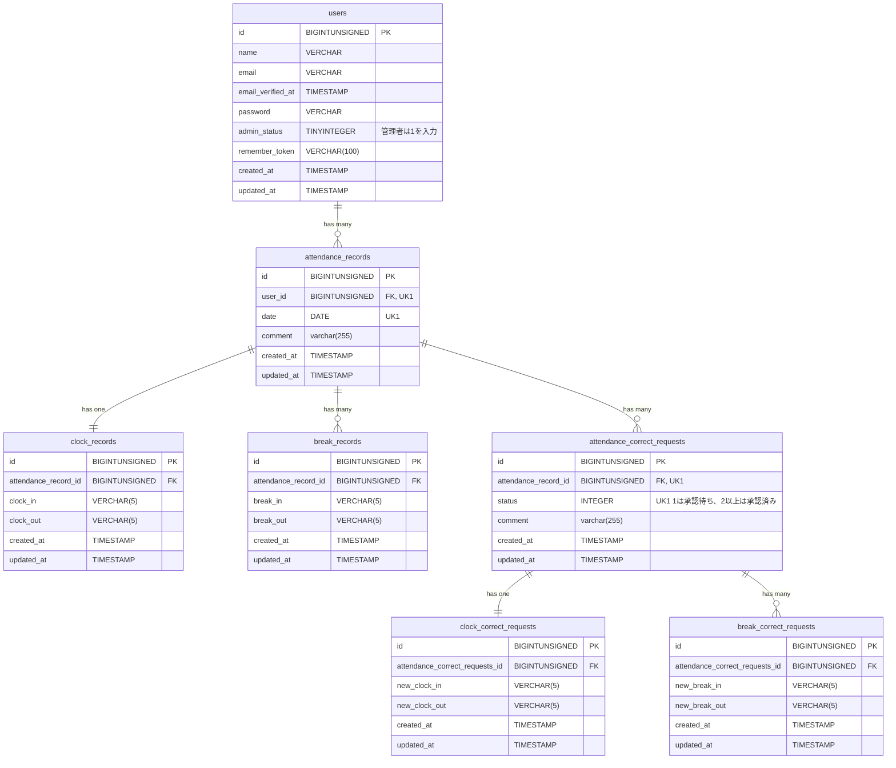

```mermaid

erDiagram
    users {
        id  BIGINTUNSIGNED "PK"
        name VERCHAR
        email VERCHAR
        email_verified_at TIMESTAMP
        password VERCHAR
        admin_status TINYINTEGER "管理者は1を入力"
        remember_token VERCHAR(100)
        created_at TIMESTAMP
        updated_at TIMESTAMP
    }

    attendance_records {
        id BIGINTUNSIGNED "PK"
        user_id BIGINTUNSIGNED "FK, UK1"
        date DATE "UK1"
        comment varchar(255)
        created_at TIMESTAMP
        updated_at TIMESTAMP
    }

    clock_records {
        id BIGINTUNSIGNED "PK"
        attendance_record_id BIGINTUNSIGNED "FK"
        clock_in VERCHAR(5)
        clock_out VERCHAR(5)
        created_at TIMESTAMP
        updated_at TIMESTAMP
    }

    break_records {
        id BIGINTUNSIGNED "PK"
        attendance_record_id BIGINTUNSIGNED "FK"
        break_in VERCHAR(5)
        break_out VERCHAR(5)
        created_at TIMESTAMP
        updated_at TIMESTAMP
    }

    attendance_correct_requests {
        id BIGINTUNSIGNED "PK"
        attendance_record_id BIGINTUNSIGNED "FK, UK1"
        status INTEGER 　"UK1 1は承認待ち、2以上は承認済み"
        comment varchar(255)
        created_at TIMESTAMP
        updated_at TIMESTAMP

    }

    clock_correct_requests {
        id BIGINTUNSIGNED "PK"
        attendance_correct_requests_id BIGINTUNSIGNED "FK"
        new_clock_in VERCHAR(5)
        new_clock_out VERCHAR(5)
        created_at TIMESTAMP
        updated_at TIMESTAMP
    }

    break_correct_requests {
        id BIGINTUNSIGNED "PK"
        attendance_correct_requests_id BIGINTUNSIGNED "FK"
        new_break_in VERCHAR(5)
        new_break_out VERCHAR(5)
        created_at TIMESTAMP
        updated_at TIMESTAMP
    }

    users ||--o{ attendance_records : "has many"
    attendance_records ||--|| clock_records : "has one"
    attendance_records ||--o{ break_records : "has many"
    attendance_records ||--o{ attendance_correct_requests : "has many"
    attendance_correct_requests ||--|| clock_correct_requests : "has one"
    attendance_correct_requests ||--o{ break_correct_requests : "has many"

```
